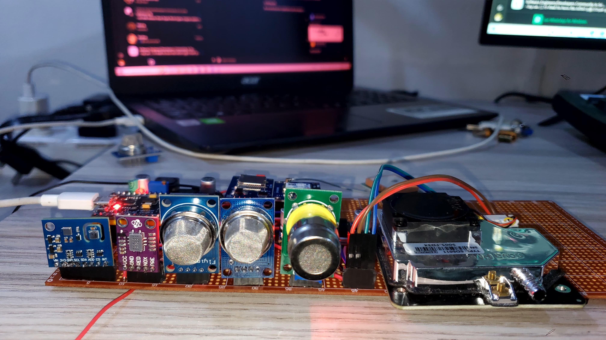
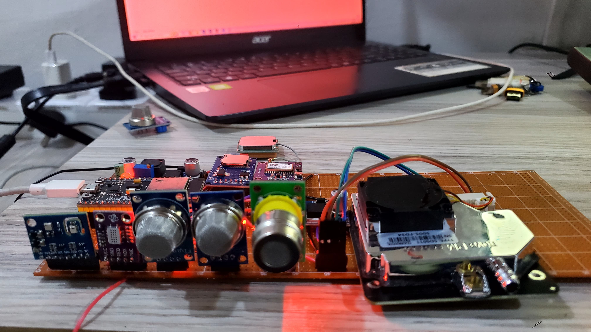
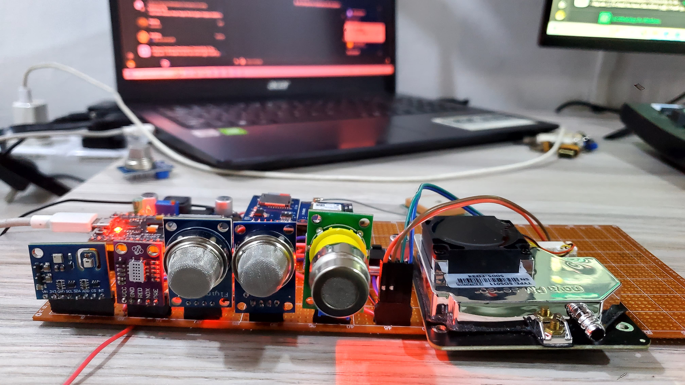
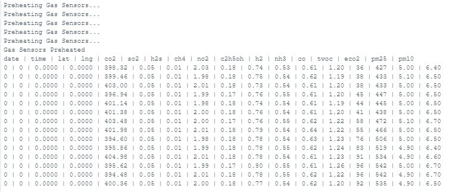

# EnviroSense AQMS: Air Quality Monitoring System



## Overview
EnviroSense AQMS is a comprehensive air quality monitoring system built on Arduino/ESP32 platforms. It measures a wide range of air quality parameters including CO2, SO2, H2S, CH4, NO2, TVOCs, and particulate matter (PM2.5, PM10). The system also includes GPS functionality for location tracking and SD card logging for data storage.

## Table of Contents
- [Features](#features)
- [Components](#components)
- [Hardware Design](#hardware-design)
- [Software Design](#software-design)
- [Setup Instructions](#setup-instructions)
- [Configuration](#configuration)
- [Usage](#usage)
- [ADC Improvements](#adc-improvements)
- [Data Logging](#data-logging)
- [License](#license)
- [Contact](#connect-with-me)

## Features
- **Comprehensive Air Quality Monitoring:** Measures multiple air quality parameters (CO2, SO2, H2S, CH4, NO2, CO, TVOCs, PM2.5, PM10)
- **GPS Integration:** Tracks location data with each measurement
- **Data Logging:** Records data to SD card for long-term storage and analysis
- **Configurable Parameters:** Easily adjust sensor calibration values through configuration file
- **ADC Stability Improvements:** Enhanced analog reading reliability for ESP32 implementation
- **Real-time Monitoring:** Continuous monitoring with customizable sampling intervals



## Components
### Hardware
- ESP32 or Arduino microcontroller
- MG-811 CO2 sensor
- MQ-136 SO2/H2S sensor
- MQ-4 CH4 sensor
- MICS-4514 NO2/CO sensor
- ENS160 TVOC/eCO2 sensor
- SDS011 particulate matter sensor
- GPS module
- SD card module
- Power supply components
- Connecting wires and housing

### Software
- Arduino code for sensor reading and data processing
- Configuration system for sensor calibration

## Hardware Design
The system is designed as a portable monitoring station with all sensors integrated into a single unit. The ESP32 version includes enhanced ADC reading capabilities to improve analog sensor accuracy.



## Software Design
The software architecture consists of:

1. **Sensor Interfaces:** Dedicated classes for each sensor type
2. **Data Processing:** Algorithms for converting raw sensor data to gas concentrations
3. **Calibration System:** Configuration-based calibration for each sensor
4. **Data Logging:** SD card logging with timestamp and GPS coordinates
5. **ADC Improvements:** Enhanced analog reading reliability for ESP32

## Setup Instructions
### Hardware Setup
1. Connect all sensors to the appropriate pins as defined in the code
2. Ensure proper power supply for all components
3. Insert formatted SD card into the SD card module

### Software Setup
1. Clone the repository
```bash
git clone https://github.com/yourusername/envirosense-aqms.git
cd envirosense-aqms
```

2. Install required Arduino libraries:
   - TinyGPS++
   - SoftwareSerial/HardwareSerial
   - SD
   - MQUnifiedsensor
   - SDS011
   - DFRobot_ENS160
   - MICS_4514

3. Upload the appropriate code based on your platform:
   - `src/main.cpp` for Arduino
   - `src/esp_main.cpp` for ESP32

## Configuration
The system uses a configuration file (`config.txt`) stored on the SD card to set various parameters:

```
CO2_inertia=0.99
CO2_tries=100
RatioMQ136CleanAir=3.6
RatioMQ4CleanAir=4.4
MQ136_H2S_A=36.737
MQ136_H2S_B=-3.536
MQ136_SO2_A=503.34
MQ136_SO2_B=-3.774
MQ4_CH4_A=1012.7
MQ4_CH4_B=-2.786
ENS160temperature=25.0
ENS160humidity=50.0
warmupTime=10000
```

## Usage
After powering on the device:

1. The system initializes all sensors and performs a warm-up period
2. Sensors continuously measure air quality parameters
3. Data is logged to the SD card at the specified interval
4. GPS coordinates are recorded with each measurement
5. Monitor the Serial output for real-time readings



## ADC Improvements
The ESP32 version includes special handling for ADC (Analog-to-Digital Converter) readings to improve stability and accuracy:

- **Multiple Samples:** Averages multiple readings for each measurement
- **Discard Initial Readings:** Removes unstable initial ADC values
- **Settling Time:** Adds delays between channel switching
- **Proper ADC Configuration:** Sets correct resolution and attenuation

See `doc/README_ADC_IMPROVEMENTS.md` for detailed information.

## Data Logging
Data is logged to the SD card in CSV format with the following fields:
```
date, time, lat, lng, co2, so2, h2s, ch4, no2, c2h5oh, h2, nh3, co, tvoc, eco2, pm25, pm10
```

This format allows easy import into spreadsheet applications or data analysis tools.

## License
This project is licensed under the MIT License. See the [LICENSE](LICENSE) file for details.

## Connect with me
<p align="left">
<a href="https://linkedin.com/in/yourusername" target="blank"></a>
<a href="https://twitter.com/yourusername" target="blank"></a>
<a href="https://fb.com/yourusername" target="blank"></a>
<a href="https://instagram.com/yourusername" target="blank"></a>
</p>